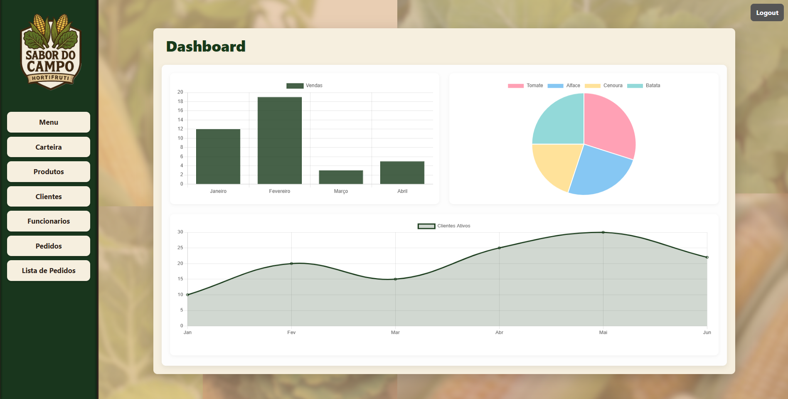

# 📘 Projeto: Desenvolvimento de Software Corporativo

Este repositório contém uma aplicação corporativa completa desenvolvida com foco em **gestão empresarial**, **segurança**, **escalabilidade** e **organização modular**, utilizando:

## 🚀 Tecnologias Utilizadas


---

# 🖥️ Interface do Sistema

## 🔐 Tela de Login


## 📊 Dashboard


## 📦 Lista de Pedidos


## 💰 Pagamento PIX


A aplicação implementa um **ERP corporativo** com:

- Dashboard interativo  
- Fluxo completo de pedidos  
- Cadastros administrativos  
- Pagamentos integrados  
- Autenticação  
- Controle de acesso baseado em roles  
- Auditoria e logs  

---

## 🏛 Arquitetura e Stack

O projeto foi desenhado com foco em **organização, segurança e modularidade**.

### 🔧 Backend  
Construído em **Node.js** com **Express**, garantindo performance e flexibilidade para criação de APIs e sistemas web robustos.

### 🎨 Frontend (Server-Side)  
Renderização de páginas dinâmica via **EJS**, permitindo interfaces rápidas e leves.

### 🗄 Banco de Dados  
- **MySQL** como banco relacional  
- Manipulação via **Knex.js**, um Query Builder seguro e de fácil manutenção  

Essa stack resulta em uma base **escalável, segura e altamente manutenível**.

---

## 🧩 Camadas da Aplicação

### 1. **Services**
Contém toda a lógica de negócio:

- Regras de negócio  
- Validações  
- Processamento de dados  
- Comunicação com o banco via Knex  

Mantém o código limpo, organizado e sem duplicações.

### 2. **Routes**
Responsáveis por:

- Receber requisições  
- Chamar o service correto  
- Retornar HTML (EJS) ou JSON  

Separa responsabilidades, facilitando manutenção e evolução.

---
# 📂 Estrutura de Pastas

```bash
project/
├── node_modules/
├── renderer/
│   ├── public/
│   └── views/
├── server/
│   ├── routers/
│   └── services/
├── app.js
├── db.js
├── docker-compose.yaml
├── initDataBase.js
├── main.js
├── preload.js
├── package.json
├── package-lock.json
└── .env
```

## 🔐 Segurança

A aplicação possui um sistema robusto baseado em:

### 1. **Autenticação por Sessions**
- Cookies de sessão armazenados no servidor  
- Nenhuma exposição de tokens  

### 2. **Controle de Acesso por Roles**

| Role        | Permissões |
|-------------|------------|
| **Admin**       | Acesso total, relatórios, auditoria, gestão completa |
| **Funcionário** | Acesso operacional: cadastros, pedidos, clientes |

Garante segurança contra acessos indevidos.

---

## 🧠 Funcionalidades Corporativas

### 1. 📊 **ERP com Dashboard**
Indicadores estratégicos como:

- Vendas  
- Produtos mais vendidos  
- Movimentação de clientes  
- Fluxo operacional geral  

Inclui gráficos e métricas com abordagem de **Business Intelligence**.

---

### 2. 🗂 **Cadastros Principais**
Módulos administrativos completos:

- Funcionários  
- Clientes  
- Produtos (estoque, preço, catálogo)  

Base essencial para operações e relatórios.

---

### 3. 🛒 **Pedidos & Operações**
Permite:

- Criar e atualizar pedidos  
- Controle de etapas  
- Associação ao cliente  
- Cálculo automático de valores  

Ideal para ambientes com alto volume operacional.

---

### 4. 💰 **Pagamentos Integrados**
Integração com **AbacatePay**, permitindo:

- Geração de PIX  
- Processamento automático  
- Gestão financeira interna  
- Carteira virtual para armazenar saldo  

Complementa o ERP com fluxo financeiro completo.

---

### 5. 🔍 **Segurança & Auditoria**
- Triggers no banco registram *quem*, *quando* e *o que mudou*  
- Logs aplicacionais reforçam a auditoria  
- Garantem rastreabilidade total

---

### 6. 🧱 **Outras Funcionalidades**
- Tabelas administrativas organizadas  
- Estrutura limpa, modular e expansível  
- Rotas padronizadas  
- Arquitetura pronta para expansão corporativa  

---

## ▶️ Como Rodar o Projeto

### 1. Configure as credenciais do banco no arquivo:
`db.js`

### 2. Instale as dependências:
```bash
npm i
npm run start
